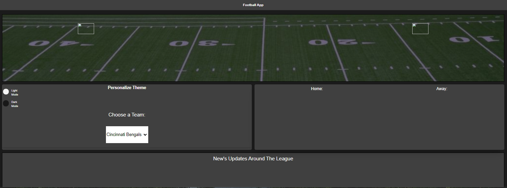

# The Football App
### An App designed to put all your essential football information in one place. If you have ever been curious about a team in the NFL then look no further. This App is designed to display current and future information about any of the 32 teams in the league. The user first must select an Nfl team from the drop down menu. Once a team is selected the top section will display their next game. This will include records for both the home and away team, also the teams logos will appear to aid and visiualization as well as provide atthestic appeal. Next the current weather in the hosting city will appear as an icon. The forecasted high temperature will be displayed as well as the forecasted wind speed. On the right you will find the season schedule for the team the user selected. This will include all previous and future scheduled games. On the bottom of the page any recent news articles pertaining to the league will be published. A URL link will display on the bottom which once clicked will direct the user to the news page.

### Use Cases
Whether you are planning to attend an NFL football game or are a fantasy manager just curious about an upcoming game then look no futher. User's will select a team and then the App will load current information regarding who they play next and their season schedule. Other information such as current weather and weather forecasted for gameday will appear. Also the teams current records will display. The user will be able to see the season schedule and some current news around the league will appear on the bottom section. 

#### Jumbotron Screen 

